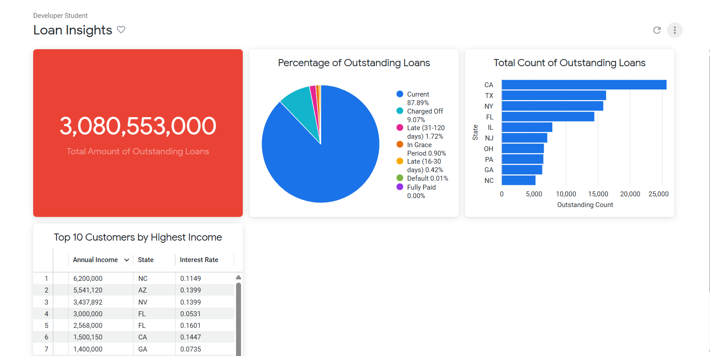

# 📊 Google Cloud Data Analytics Labs

Este repositorio contiene los laboratorios y el proyecto final realizados durante el curso **Google Cloud Data Analytics Certificate**.

El objetivo de este repositorio es demostrar habilidades prácticas en análisis de datos utilizando herramientas modernas del ecosistema de Google Cloud.

---

## 🚀 Tecnologías utilizadas

* SQL
* BigQuery
* Looker (visualización de datos)
* Google Cloud Platform

---

## 📁 Estructura del repositorio

```
├── Project-capstone-fintech-loan-analysis/
│   ├── sql/
│   ├── dashboards/
│   ├── assets/
│   └── docs/
```

* **sql/** → consultas utilizadas para exploración, transformación y análisis
* **dashboards/** → visualizaciones generadas en Looker
* **assets/** → imágenes del proyecto (dashboard, arquitectura)
* **docs/** → documentación y conclusiones

---

## 📌 Proyecto destacado

### 💰 Fintech Loan Analysis (Capstone Project)

Proyecto final del curso enfocado en el análisis de préstamos financieros.

### Objetivo

Analizar el estado de los préstamos para obtener insights sobre:

* volumen total de préstamos pendientes
* distribución por estado (Current, Late, Charged Off)
* concentración geográfica
* perfil de clientes con mayores ingresos

### Proceso

1. Exploración de datos con SQL en BigQuery
2. Transformación y agregaciones
3. Creación de métricas clave
4. Desarrollo de dashboard en Looker

### Dashboard



---

## 📊 Habilidades demostradas

* Escritura de queries SQL
* Análisis exploratorio de datos
* Creación de métricas de negocio
* Desarrollo de dashboards interactivos
* Interpretación de datos para toma de decisiones


## 📬 Contacto

* GitHub: https://github.com/FacuGraziano
* Linkedin: www.linkedin.com/in/facundo-graziano-709b6436a

---
